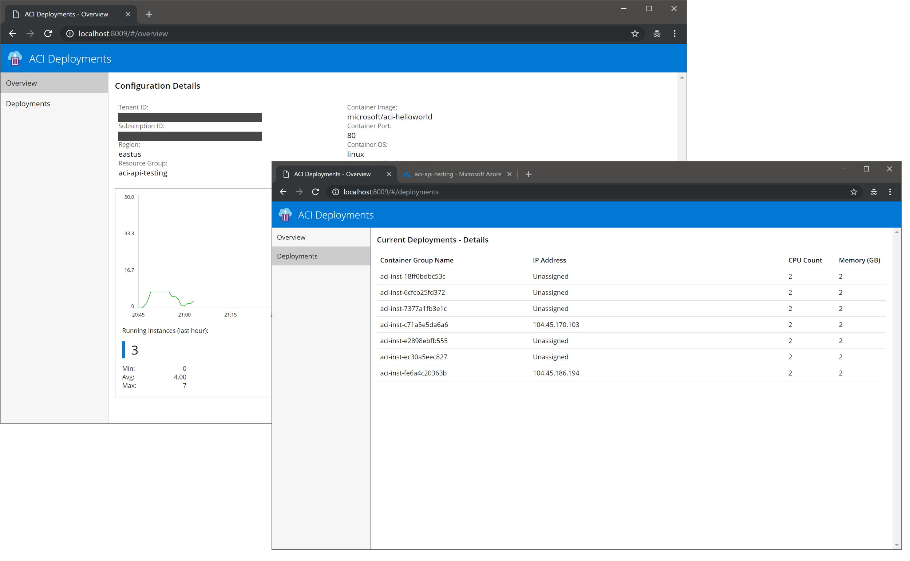

## ACI Deployment API

This project presents an API shim to deploy pre-configured Azure Container Instances on the fly, and give a preliminary dashboard to monitoring status of the deployed / running images. 

### What problems does this solve?

The target use case for this sample application is client applications (i.e., mobile, web, desktop) that should not / do not have enough priviledges to directly call the Azure management API's needed for deploying new resources (such as ACI instances). The application leverages a service principal that has the required isloated priviledges without needing to give extended permissions to end user/client applications.

### Authentication / Authorization

While this application provides a broker to make Azure resource calls on-behalf of another less-priviledged user, the application itself doesn't currently make any assumptions or provide any AuthN/AuthZ itself. For Azure AppService specificly, it is recommended to enable Easy Auth to ensure the application is only called from an authorized context.

### API Methods

The following API methods are exposed from this application:

* `GET /api/deployments`
    * This lists all active deployments, and currently returns the same JSON format that the Azure REST api does.
* `POST /api/deployments`
    * This requires a body payload describing the number of CPU's and memory that are requested:
        * For example: `{numCpu:2, memoryInGB: 2}`.
    * Note this is a synchronous / blocking call - implementing the job/polling mechanism correctly was going to add more work that was necessary for this PoC.
* `GET /api/deployments/{deployment-name}`
    * This will return details about the specific deployment.
* `DELETE /api/deployments/{deployment-name}`
    * This removes (deletes) the specified deployment. Note this does *NOT* stop the instance; rather the entire container group resource is deleted.
* `POST /api/deployments/{deployment-name}/stop`
    * This stops (but does not delete) the specified deployment. Note stopped deployments may be re-used later (see [Container Group Reuse](docs/ContainerGroupReuse.md))

### Building

There are tasks defined in `package.json` that are used to build the application. The most common one will be `npm run build`, which will create the `/dist` folder that is to be used for final depoloyment. 

Note that on Azure AppServices environments, this folder should be the root of the ZIP deployment package.

### Deployment

The can be deployed via any appropriate service (i.e., AppService, ACS, etc.), but will require the following environment variables to be set:

```
TENANT_ID=
CLIENT_ID=
CLIENT_SECRET=
SUBSCRIPTION_ID=
REGION=
RESOURCE_GROUP_NAME=
CONTAINER_IMAGE=
CONTAINER_PORT=
CONTAINER_OS_TYPE=
CONTAINER_REGISTRY_HOST=
CONTAINER_REGISTRY_USERNAME=
CONTAINER_REGISTRY_PASSWORD=
REPORTING_REFRESH_INTERVAL=
```

For local development, you may place a `.env` file in your root folder to set these variables.

### Topics

* [Architecture Overview](docs/ArchitectureOverview.md)
* [Reporting Overview](docs/ReportingOverview.md)
* [Container Group Reuse](docs/ContainerGroupReuse.md)
* [Container Group Naming](docs/ContainerGroupNaming.md)

### TODO

The dashboarding experience is rather limited right now, but the intention is to give a better overview on the history of utilization. Note that the reporting data is ephemeral and held only in-memory on the nodes. This needs moved into a persistent storage location.

Additionally, there are some potential issues with the long-running POST requests to `/api/deployments` (which deploys new container groups). This needs replaced with a proper background job system that passes continuation tokens back to the clients.


